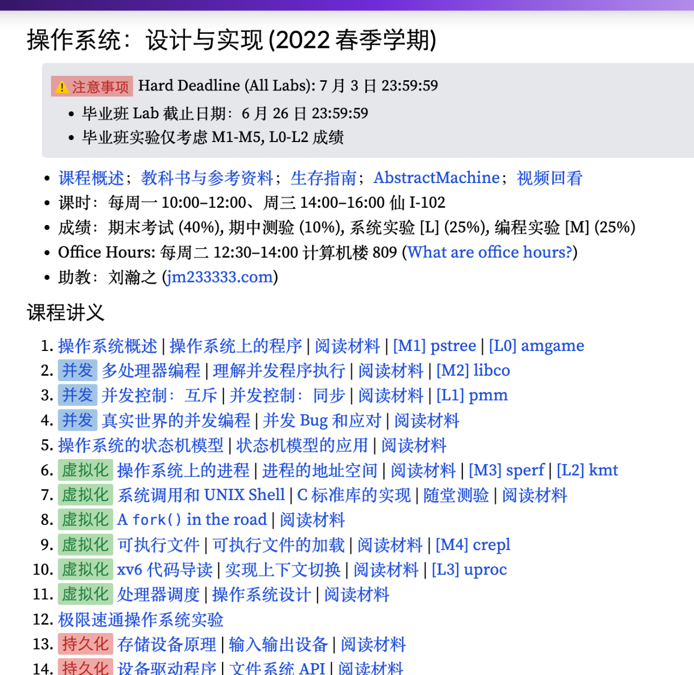

# 第一份实习! Why and How ? v2.0.0

**找到工作后，回头看，皆是遗憾😭**

---

# 开始前我想说几句

- 我不是大佬，不是学习能力很强的人，也没有特别丰富的职业经历。我的建议都会尽量中立客观，同时我的观点难免会一定带有主观色彩，请提取符合自己价值观的信息。
- **欢迎随时打断**。如果你的问题我没把握，我会说不知道/没把握讲。
- 资料会在最后总结出来
- 你也想修改的话，请私聊我，给你增加权限。
- 创了个群，希望有更多人能加入，一起分享

# 启

以下是我给自己提出的几个问题：

### **从大一，到找到实习，转正拿到offer，谁对我的学习和工作影响最大？**

[胡津铭](https://conanhujinming.github.io/) ，他的 [19CS小硕校招面试心得与自学CS经验及找工作分享](https://conanhujinming.github.io/post/tips_for_interview/)，**非科班出身->努力考研到浙大->自学cs三年->拿到google实习->毕业斩获offer无数**，他能选择一份待遇又高工作时间又965的工作。 

 这让我对计算机专业毕业找工作的前景有了清晰的认识，这是一幅美好的图卷--通过努力学习计算机基础，就能找到一份回报丰厚的，并且行业前景回报丰厚的工作，这对大一对我的吸引力是非常非常大的，我也暗暗下定了好好学习，毕业后拿offer到手软的决心。 当然，我很快就混成了一个浑浑噩噩的带学生，一直拖到大三，才慢慢找回自己想去找工的初心和勇气。现在我还不时去翻翻他的博客，每次看都会有一点新的启发。 

 你知道吗？真正二次元遇到自己喜欢的游戏，会买三份--一份玩，一份膜拜，一份传教。胡神激励了我，也让我感觉到一种二次元传教士一样的使命，我有责任让大家都知道这一条路，这很有价值。

### **我大学最大的遗憾是什么(非情感向)？**

- 我最大的遗憾就是大学没有好好学习，没有早早去找实习。导致现在技术太菜，~~没能加入米哈游😭~~
- 没有能更好规划吧，到大四很多东西才想清楚，失去了很多不同的选择

### **我为什么会来分享？**

- 和蔡老师谈心，她觉得我的经历很曲折，很有借鉴意义，让我来分享
- 当然我也有些话想讲一讲，我也认为这些分享，以及收集的资料能够帮助一些同学。

# Why 第一份实习？

## 个人倾向

1. 本科成绩不佳，无法直接保研
2. 厌恶应试学习，为了考研进行学习对我来说是痛苦且枯燥的。
3. 非常喜欢实践，做具体的事情，把学到的东西真实运用在生产生活中能带给我的成就感远超一切。
4. 机会成本：觉得读研三年时间成本很大，可能工作三年也是很好的选择

## 功利一点讲

- 实习经历很有用
    1. 有第一份实习，找到更好的第二份实习/工作，会简单很多。---讲讲和mentor的聊天
    2. 以去年秋招情况来看，我们的竞争者都有实习经历
    3. 实习转正：熟悉公司的技术栈，适应公司文化，更短的考察期....
    4. 计算机专业实习能赚到钱(~~虽然比正式少太多了，但隔壁金融可是一分没有啊~~)

## 上一些高度

- 我们需要一个可行的方法论来优化大学生涯，以期望寻找到那个最优解。
1. 假如小A知道自己的目标：出国留学，他应该竭尽全力逼近这个目标，漂亮的gpa，合格的英语成绩，一段研究经历，一篇论文，💰....他所要努力的方向比较明晰了。(~~当然，我认为的本科生留学最优解是transfer~~)
2. 假如小B不知道自己的目标呢，他有前40%排名，保研，找工，留学.....此时如何优化大学生涯。如果沿着高中生的思维惯性思考，应该努力读书，博取保研；考研也是可以通过努力读书来获得成功的。小B很可能被这种思维所限制
    
> 尽管每个局部选择可能都是最优的，但最终归于普通。这就像贪心算法的问题——取决于初值，沿着梯度优化最终只能得到局部最优解。(摘自在Google的这四年（四）)
> 
3. 我的思路是一种类似于**模拟退火**的思想。---随机游走，在迭代进行过程中减少随机因子，更有可能收敛到全局最优。找到一份实习并且干几个月，是确定自己是否适合(本科毕业)就参与工作，适合哪种类型工作的最好方法。

# 我的找工经历

**大一懵懂无知；大二保研无望，完全摆烂。**

**大三找到学习路径，开始努力打基础**

- 从热力图来看，2021年十月底才开始有了提交，看热力图规律--一阵猛干，然后摆烂几天..。到2022年找到实习后，学习慢慢变散漫了
  
    
    
- 从大三上到2022年三月，我更多注重于计算机基础知识的学习。没有对找工作进行针对性学习---没开始刷题，没有背八股，没有投递目标岗位的预期，最致命的是没有对自己清晰的认识。

**2022年春招--愁云惨淡**

- 讲述自己的春招经历，投出简历寥寥，被阿里字节分别两次一面挂，失去信心
- 四月份面试完华为两面通过，却迟迟不发offer，被海王华为狠狠的扎心。我绝望的躺在床上却睡不着，只能去做张宇18讲，感受到了前所未有的压力。
- 后面四五六月份都在摆烂。。。

**秋招--绝地求生**

- 我的秋招从夏天开始：
    - 前几次的精准投递->全部进面试，全部都失败。(数据库创业公司，或大公司的数据库相关岗位)
    - 开始投递更多岗位，投递hc更多的后端；并且实习和正式工作一起找
    - 海投->烦人的笔试->往往成为kpi面的面试->0 offer
    - 8月底拿到个实习offer，以孤注一掷的心态去了，幸好现在结果比较满意。
    
    

### 教训

- 提前规划，提前准备；如果自制力不行做不到怎么办，把握春招，秋招机会，多投递，多尝试。水平不够，拿不到offer怎么办？
- **海投**，总有一家公司和你投缘；找实习机会，而不仅仅是正式机会
- 把握行业周期。下水后，才知道水是这么的冷-->>早上岸，早躺平
- [人在工位，心在放假，这种感觉谁懂啊！_牛客网](https://www.nowcoder.com/discuss/438278424977825792) (牛客2022热帖)

# How--第一份实习（工作）

## CS基础

### 谈谈对学院培养计划的看法（私货）

> 国内绝大部分大学的本科教学，不是濒临崩溃，而是早已崩溃。 《交大生存手册》
> 

左图：老师，"每周一个实验，要求提交实验报告和代码"

右图：我!?"**光是认真完成课程已经很累了，你还要我怎样？**"

### 培养计划安排不合理

- 大一课程课程不足以打下良好计算机基础。数据结构居然不是大一学？
- 大二安排太多非必要课程。如模电，大物实验
- 大三才学习os，计网等找实习必要课程，太迟了...

UCB的[eecs培养计划](https://hkn.eecs.berkeley.edu/courseguides)

### 学生课业压力较大

- 如果要谋求取得高分，课业压力会很大
- 像我一样谋求中庸的学生，平常也很忙(课表满当当)
- ~~划划水还是很轻松的[旺财]~~

### 课程内容过旧，课程质量低

- 使用的老旧的国产教科书，用了10年的实验.....不便过多吐槽
- 我期望的目标：更新，开源开放，**入门要容易**，对学术诚信的要求
- 优秀范例：
    - 国外的[cs61a](https://cs61a.org/)，[cs61b](https://sp23.datastructur.es/)
    
    
    
    - 国内的优秀范例 [操作系统：设计与实现](http://jyywiki.cn/OS/2022/)
    
    

**道阻且长，大家互相勉励**

> 我觉得，本科教育至少得展现它应有的诚意，一种分享知识的诚意，一种以人为本的诚意，一种注重学生体验的诚意。它至少不应该是一种恶意，一种拼比知识的恶意，一种胜者为王的恶意，一种让人学无所得的恶意。https://csdiy.wiki/%E5%90%8E%E8%AE%B0/
> 

### 方法论：

学什么？计算机基础课程：数据结构与算法，OS，组成原理与体系结构，计算机网络，数据库.......更多进阶课程

**刷课：**

- 打好计算机基础是一辈子的事情，学这么多门课很累很难很痛苦，但学习过程很有趣，收获知识很有成就感(~~以前几年行情来看，每多学好一门课，代表着实打实的money呀~~ )
- 我不会给出具体的建议，我会列出一个对我有帮助的指导资料，当然这个资料很符合我个人倾向，不一定被所有人喜欢，也请大家找到适合自己的学习路径。
- [北大佬的cs自学指南](https://csdiy.wiki/)
- [https://teachyourselfcs.com/](https://teachyourselfcs.com/) ([自学计算机科学](https://github.com/izackwu/TeachYourselfCS-CN/blob/master/TeachYourselfCS-CN.md#%E8%87%AA%E5%AD%A6%E8%AE%A1%E7%AE%97%E6%9C%BA%E7%A7%91%E5%AD%A6))
- [从小白到BAT后端工程师的自学路线 - MutexLock的文章 - 知乎](https://zhuanlan.zhihu.com/p/130364187)

**看书：**

**多写代码**

刷题，写小项目....

### 想速成？

[Go 转学指南](https://github.com/RamezesDong/talk/blob/main/internship/go%E8%BD%AC%E5%AD%A6%E6%8C%87%E5%8D%97.md)

## 刷题

每个公司都会以算法题刁难同学，写出中国大多数公司的算法题，需要的就是刷题，目标做出leetcode easy 和 mid。刷题量 200+, 越高越好

怎么刷？

- 专题刷，一个类型一个类型的刷[codetop](https://codetop.cc/home) 刷最高频的题，从高往低刷将刷题变成习惯
- 我是为了找工作，临阵磨枪刷题，因为自驱力太差，没法养成刷题习惯。
- ~~去年看王道考研时发现，数据结构大题很多都是leetcode技巧题，比如[相交链表](https://leetcode.cn/problems/intersection-of-two-linked-lists/)，还蛮有意思的~~

## 八股文

例如： TCP 三次握手过程是怎样的？两次不行吗，四次呢？重载(Overload)和重写(Override)的区别是什么？

- 没有太好方法：理解➕背诵
- 讲讲我不背八股的失败故事--字节三面被面试官吊打的故事

## 项目

要有一个自己的项目，同时强调自己对项目原理的理解。比如背后有什么技术，使用的框架原理......

怎么有第一个项目呢？ 

- 课程项目
- 网上的开源小项目-- [小生凡一](https://github.com/CocaineCong)
- 参与运用于工程实践的开源项目，github很多 [开源趋势网站](https://ossinsight.io/)
- 实习，参与公司的项目

## 软技能心态：

不要狂傲不逊，恃才傲物，也别畏畏缩缩。

自信大方实事求是：不知道就说不知道。如果简历修饰得超出真实水准，会给面试官很高的预期，更容易留下不好的印象

保持沟通：一般来说，面试官都会更喜欢能保持良好沟通交流的同事，也会以此来筛选候选人

代码提高可读性：不要用a, b, c这种变量，使用可读性高的变量名和函数名

## 运气+时代背景

- 可遇不可求的实力
- 过去十年，是全球资本流动性格外充裕的十年+移动互联网爆发的十年(时代的红利，造了多少富裕神话)。而我们这一代面临的不确定性会更多，竞争会更激烈，机会也更多元

# 互动与致谢

感谢蔡老师给我输出内容的机会，感谢同学们看到这，也感谢无数愿意分享的网友。人人为我，我为人人。

# 附加资料

## **文章网站**

- 简历模版 [https://github.com/billryan/resume/tree/zh_CN](https://github.com/billryan/resume/tree/zh_CN)
- 优秀的个人笔记 [https://github.com/huangrt01/CS-Notes](https://github.com/huangrt01/CS-Notes)
- [北大佬的cs自学指南](https://csdiy.wiki/)
- [https://teachyourselfcs.com/](https://teachyourselfcs.com/) ([自学计算机科学](https://github.com/izackwu/TeachYourselfCS-CN/blob/master/TeachYourselfCS-CN.md#%E8%87%AA%E5%AD%A6%E8%AE%A1%E7%AE%97%E6%9C%BA%E7%A7%91%E5%AD%A6))
- [https://conanhujinming.github.io/post/tips_for_interview/](https://conanhujinming.github.io/post/tips_for_interview/)
- [从小白到BAT后端工程师的自学路线 - MutexLock的文章 - 知乎](https://zhuanlan.zhihu.com/p/130364187)
- [名校公开课评价网](https://conanhujinming.github.io/comments-for-awesome-courses/)
- 上海交通大学自救指南 https://survivesjtu.gitbook.io/survivesjtumanual/
- 面试八股
    - [https://github.com/CyC2018/CS-Notes](https://github.com/CyC2018/CS-Notes)
    - [https://github.com/huihut/interview](https://github.com/huihut/interview)
    - [https://xiaolincoding.com/](https://xiaolincoding.com/)
- 应届生如何半年找到一份数据库内核开发的工作 - Smith的文章 - 知乎
https://zhuanlan.zhihu.com/p/490171772
- 校招C++大概学习到什么程度？ - 知乎用户39FLt3的回答 - 知乎 [https://www.zhihu.com/question/290102232/answer/1548364491](https://www.zhihu.com/question/290102232/answer/1548364491)
- [如何看待2022年秋招Java后端开发岗一片红海？ - 圆角骑士魔理沙的回答 - 知乎](https://www.zhihu.com/question/471105298/answer/1995471916)
- 【2022届校招】c++ 面经合集 - BrianLee的文章 - 知乎 [https://zhuanlan.zhihu.com/p/547371847](https://zhuanlan.zhihu.com/p/547371847)
- **校招面试不完全指南** https://www.zackwu.com/posts/2020-10-05-an-incomplete-guide-to-campus-recruitment-interviews/

## 播客

- [72.2022最冷校招：毁约、卷实习、考研考公](https://www.xiaoyuzhoufm.com/episode/62f349ab20298b975e3535b9)
- [Ep 19. 如何成为互联网校招 offer 收割机？](https://www.xiaoyuzhoufm.com/episode/5f82d56883c34e85dde17ab8)

# 版本log

## v2.0.0

- 增加一些附加内容(~~私货~~)，增加资料
- 准备给大三同学分享，之后会将ppt附在最后
- 这个可能是最终版本了，我会去掉将个人经历的版本放在知乎上，原版可以放在个人博客

## v1.0.0 说明

给大四同学分享，展示slide 文字版

## v0.1.1 说明

大更新：

- 将声明中“之后所聊只是我个人主观得到的结论，我尽量客观公开的展示给大家”，改为“我的建议都会尽量中立客观，同时我的观点难免会一定带有主观色彩”。
    - 蔡老师想让我说说心里话：就计算机的基础课程，以及目前学院的培养计划的合理或者不合理谈谈自己的看法。我很珍惜这种思想碰撞的机会，观点必然不客观，欢迎大家来质疑，更希望有人能认可我
- 将主题从宽泛的找工作，改为了找第一份实习。目的性更明确！
- 删除回答疑问一节

## v0.0.1 说明

未完成版本，请多多给我意见。框选文字，能够直接评论。
